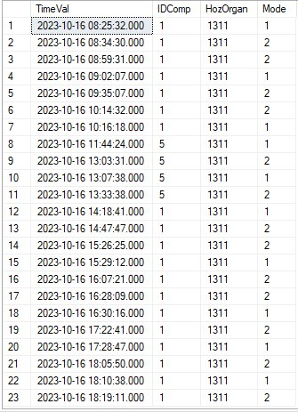

# algor_task

В базе данных, есть информация о времени входа-выхода  сотрудника из разных корпусов одного предприятия. Эта таблица,  выглядит вот так:

Колонка TimeVal обозначает время, когда пользователь приложил карту к валидатору.

Колонка IDComp обозначает id корпуса

Колонка HozOrgan обозначает id карточки сотрудника

Колонка Mode обозначает вход - если 1 и выход - если 2.

Задание:

Нужно получить общее время пребывания в каждом корпусе. Тоесть должно получиться 3 записи:

8:25:32 - 10:16:18  - 1

11:44:24 - 13:33:38 - 5

14:18:41 - 16:30:16  - 1

